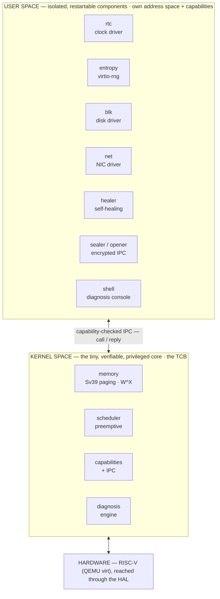
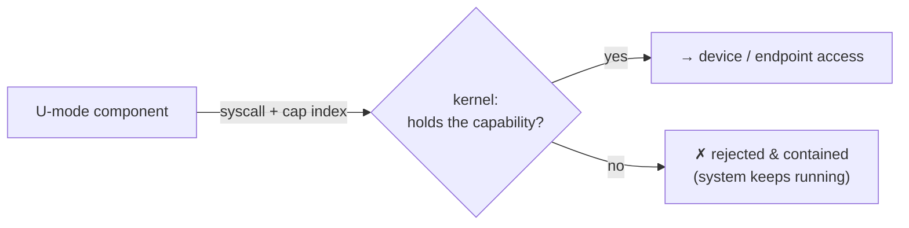
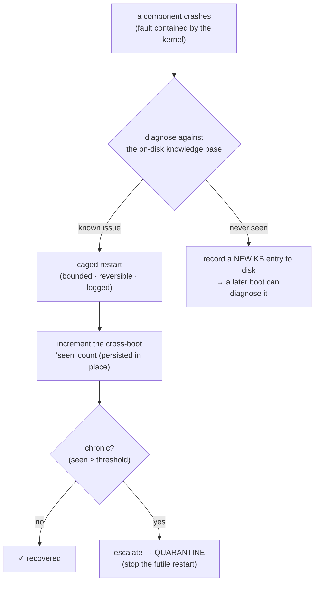
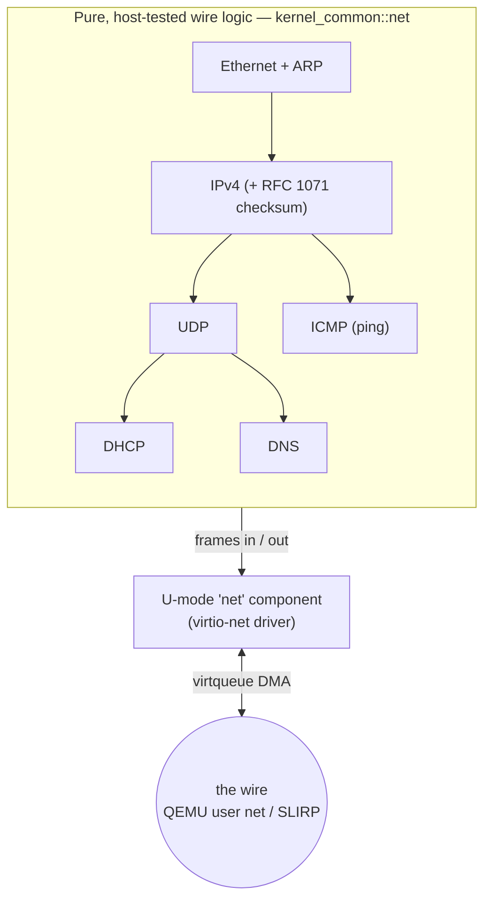
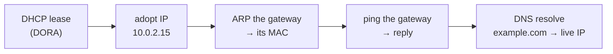

# Perenne — a 3-minute visual tour

The fast, visual companion to the [architecture overview](overview.md). It shows
**what actually runs** today (Phases 0–21) and how the three pillars fit together.
Every box below is real code that runs on each boot and is asserted by the
automated test.

---

## The system at a glance

A tiny privileged **microkernel**; everything else — drivers, the network, the
self-healer — runs as **isolated user-space components**, each in its own address
space, holding only the **capabilities** it was granted. They talk only through
capability-checked message passing.



**Why this shape:** the historically buggiest code (device drivers) runs
*unprivileged*, so a compromised driver can't take over the machine — and because
each service is an independent, restartable unit, the OS can **notice one crash,
diagnose it, and revive it without rebooting**. A monolithic kernel literally
can't do that. ([details](overview.md))

---

## Pillar 1 — a secure capability microkernel

Every privileged action is gated by an **unforgeable capability** — a token a
component holds in its own table. No capability, no access; the attempt is
*contained*, not fatal. Capabilities can be **delegated** between components at
runtime and **revoked** transitively.



On top of this: a **post-quantum** ML-KEM-768 shared secret keys a
ChaCha20-Poly1305 **encrypted IPC channel** between components — a tampered
message is rejected, and a component without the `Session` capability is refused.
([security model](security-model.md) · [ADR 0004](../decisions/0004-post-quantum-crypto.md)
· [ADR 0007](../decisions/0007-extensibility-user-space-components.md))

---

## Pillar 2 — the self-healing knowledge organism

*The soul of the project.* When a component crashes, the OS runs the full loop
**autonomously** — and, crucially, **learns across reboots**: it records a
never-seen fault to disk, so a later boot diagnoses the crash it documented itself.



This is real, not a stub: the knowledge base is **read from disk** (a minimal
filesystem over the virtio-blk driver), new entries are **written back**, and the
"seen" counter, escalation, and quarantine are all **decisions that provably
require persistent memory**. ([self-healing](self-healing.md) ·
[ADR 0005](../decisions/0005-self-healing-knowledge-organism.md))

---

## Pillar 3 — a real network stack

Built bottom-up as **pure, host-tested wire logic** (`kernel_common::net`), driven
by a NIC that is itself an **unprivileged user-space component**. The driver only
moves bytes; all framing/parsing is pure and tested with no hardware.



One boot walks the whole chain — each step feeding the next:



([ADR 0003](../decisions/0003-first-target-riscv.md) · learning notes 0033–0039)

---

## See it yourself

```powershell
./tools/run-qemu.ps1     # boot Perenne (exit QEMU: Ctrl-A then X)
./tools/test-qemu.ps1    # the automated proof: boots twice over one disk image,
                         # so the organism diagnoses the very fault it wrote last boot
```

A representative boot prints, among much else:

```
hello world from Perenne - Phase 4a (hart 0)
crypto: channel session established (ML-KEM)
net: dhcp leased 10.0.2.15 (ack)      →   net: adopted ip 10.0.2.15
net: resolved 10.0.2.2 -> 52:55:0a:00:02:02 (src 10.0.2.15)
net: ping 10.0.2.2: reply (seq 0)     →   net: dns example.com -> 172.66.147.243
heal: diagnosed KB-0005 (...) -> playbook: Restart the component ...
heal: restarted 'transient' (attempt 1)      ← contained, healed, and remembered
```

---

*Want the "why" behind each choice?* → [the ADRs](../decisions/). *The full
journey?* → [the roadmap](../roadmap/roadmap.md). *How it's built?* →
[CONTRIBUTING](../../CONTRIBUTING.md).
